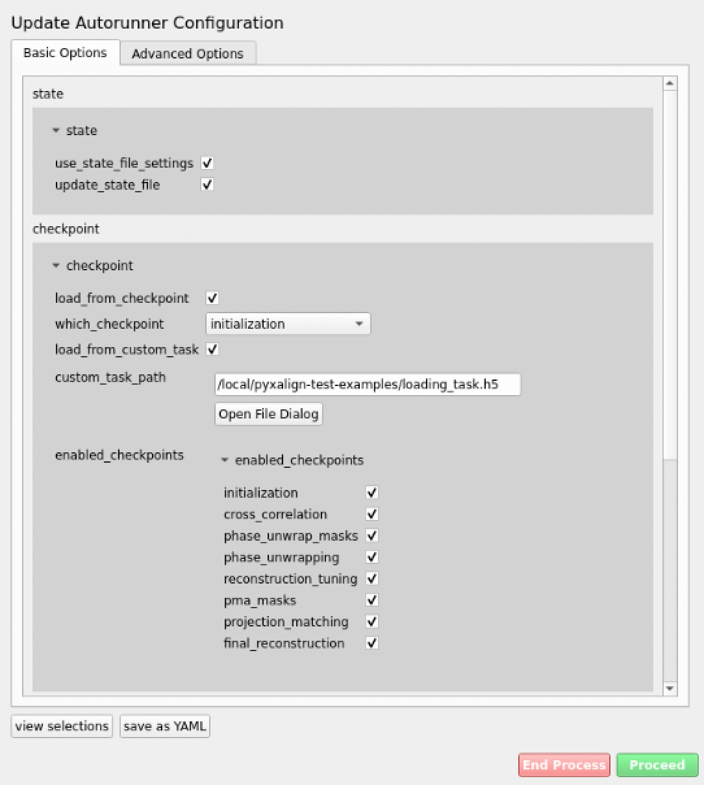
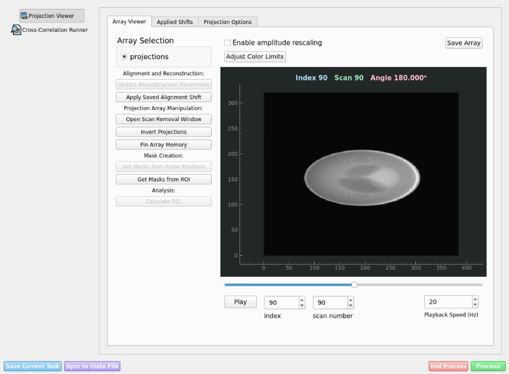

Loading Arbitrary Input Data from .npy Files
=========================================
This page shows how to package arbitrary data formats for use with the ``pyxalign-autorunner``.

Use this approach when your data is not in a natively supported beamline
format. You will first create a
:class:`~pyxalign.data_structures.LaminographyAlignmentTask` from your
raw arrays, save it to an HDF5 file, and then point the autorunner at
that saved task via the checkpoint mechanism.

**Step 1 — Prepare sample .npy files**

The helper function below demonstrates how to save a simulated phantom
dataset to ``.npy`` files.

.. code-block:: python

    import numpy as np
    from pyxalign_examples import example_utils

    # Generate and save a simulated dataset (complex projections)
    example_utils.save_phantom_to_npy(
        output_dir="/local/pyxalign-test-examples/",
        make_complex=True,
    )
    # This creates:
    #   /local/pyxalign-test-examples/projections.npy   — complex projection array
    #   /local/pyxalign-test-examples/angles.npy        — angles in degrees
    #   /local/pyxalign-test-examples/scan_numbers.npy  — integer scan numbers

**Step 2 — Build a task from .npy files**

.. code-block:: python

    import numpy as np
    import pyxalign

    # Load the arrays
    projection_data = np.load("/local/pyxalign-test-examples/projections.npy")
    angles = np.load("/local/pyxalign-test-examples/angles.npy")
    scan_numbers = np.load("/local/pyxalign-test-examples/scan_numbers.npy")

    # Define projection options
    options = pyxalign.options.ProjectionOptions()
    options.experiment.laminography_angle = 60.0   # degrees
    options.experiment.pixel_size = 1.0            # e.g. nm or µm

    # # uncomment if you need to apply some initial rotation or shear
    # options.input_processing.rotation.enabled = True
    # options.input_processing.rotation.angle = 10
    # options.input_processing.shear.enabled = True
    # options.input_processing.shear.angle = 3

    # Create the ComplexProjections object
    projections = pyxalign.data_structures.ComplexProjections(
        projections=projection_data,
        angles=angles,
        scan_numbers=scan_numbers,
        options=options,
    )

If you have ptychographic probe positions and a probe array, pass them as
well.  ``probe_positions`` must be a list of one ``(N, 2)`` float array per
projection, where each row is a ``[row, col]`` coordinate **relative to the
image centre**.  ``probe`` is a 2-D array of the reconstructed probe.

.. code-block:: python

    # Load probe positions (one (N_pos, 2) array per projection)
    probe_positions = [
        np.load(f"/local/pyxalign-test-examples/positions_{i}.npy")
        for i in range(len(projection_data))
    ]

    # Load (or supply) the probe array
    probe = np.load("/local/pyxalign-test-examples/probe.npy")

    # Create the ComplexProjections object with probe information
    projections = pyxalign.data_structures.ComplexProjections(
        projections=projection_data,
        angles=angles,
        scan_numbers=scan_numbers,
        options=options,
        probe_positions=probe_positions,
        probe=probe,
    )

    # Wrap it in a LaminographyAlignmentTask
    task = pyxalign.data_structures.LaminographyAlignmentTask(
        pyxalign.options.AlignmentTaskOptions(),
        complex_projections=projections,
    )

**Step 3 — Save the task**

.. code-block:: python

    task.save_task("/local/pyxalign-test-examples/loading_task.h5")

**Step 4 — Start the autorunner**

Run the following command in your terminal, providing a state folder
where the autorunner will store its configuration and checkpoints:

.. code-block:: bash

    pyxalign-autorunner --state-folder /local/pyxalign-test-examples/state_folder/

The first GUI screen that appears is the **Autorunner Configuration**
window. This is where you specify high-level settings such as which
processing steps to run interactively, whether to load from a
checkpoint, and where the state folder is located.

   *Autorunner initialization window.*

To load the task you saved in Step 3, enable `load_from_checkpoint` and 
`load_from_custom_task`, set `which_checkpoint` to `initialization`, and 
point the path to the ``.h5`` file you saved. Then click **Proceed**. 

If data has been successfuly loaded, the next window show appear:

   *Autorunner cross-correlation window*