pyxalign-autorunner tutorial with real data
========

.. note::

   This tutorial walks through a complete end-to-end alignment session
   using the ``pyxalign-autorunner`` GUI.

Starting the GUI
----------------

To start the GUI, pass a directory location to the `state_folder`. This folder will be contain the following files:
    - ``autorunner_state_file.yaml`` - A file containing the autorunner configuration settings. This file is updated while the autorunner GUI runs.
    - ``loading_options.yaml``` - A file containing the configuration used to load the dataset.
    - ``checkpoints/`` - A folder that will contain pyxalign task files which are saved at predetermined checkpoints. Task files can be loaded outside of the pyxalign-autorunner using `pyxalign.data_structures.load_task(file_path)`. 

.. code-block:: bash

    pyxalign-autorunner --state-folder /local/example-pyxalign-analysis/state_folder

This will create the folder ``state_folder`` in the folder ``/local/example-pyxalign-analysis/`` if it does not already exist.

The first window that appears is the **Autorunner Configuration Window**. The default configuration is usually sufficient and does not need to be changed. 

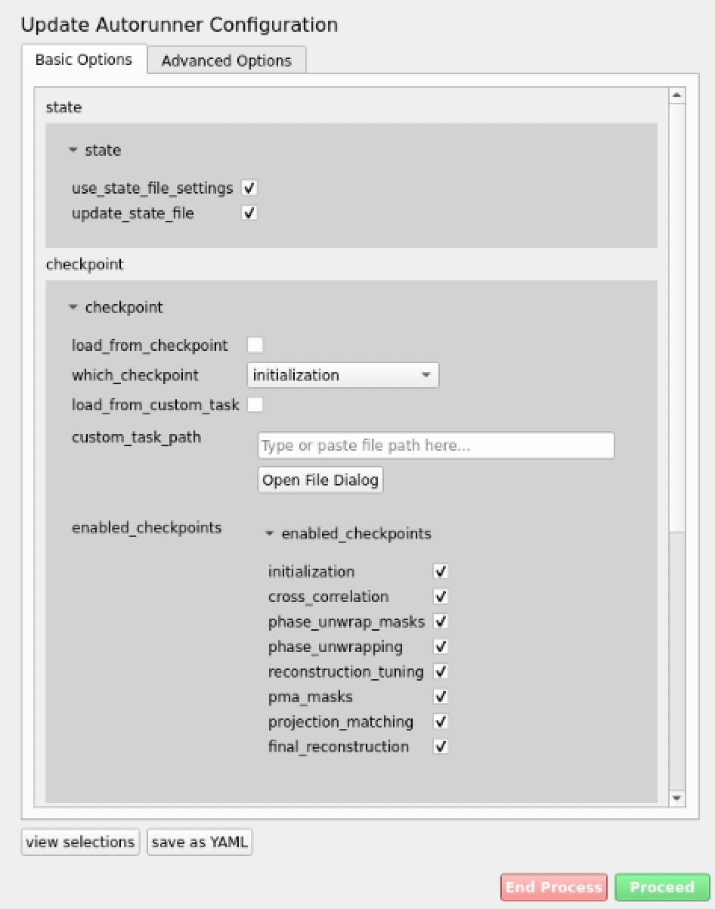

    *Initial autorunner configuration window*

Click "proceed" to continue to the data loading interface.

Loading Data
------------

Use the dropdown at the top of the window to choose the format that matches
your dataset. If your data format is not supported by pyxalign, see the 
instructions at :ref:`Loading Arbitrary Input Data from .npy Files <load-arbitrary-npy>`
for instructions on how to package your data for use with the pyxalign autorunner.

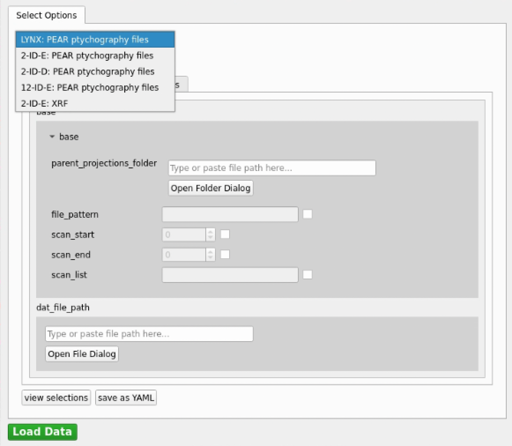

   *The Select Options dropdown showing the available input data formats.
   Here, "LYNX: PEAR ptychography files" is selected, which corresponds to
   datasets generated by the PEAR wrapper for the pty-chi ptychography
   package.*

Once a format is selected, specify the file location parameters. For PEAR
formatted data, set ``parent_projections_folder`` to the directory containing 
your reconstructed ptychography files and set ``file_pattern`` to the filename glob 
that matches your reconstruction outputs. 

The parameters in the ``base`` section is the same for all PEAR formatted datasets,
regardless of which beamline the data comes from. The ``dat_file_path`` is specific
to the LYNX experiment and specifies the path to a scan log file that includes the 
scan metadata (angles, scan numbers, etc.).

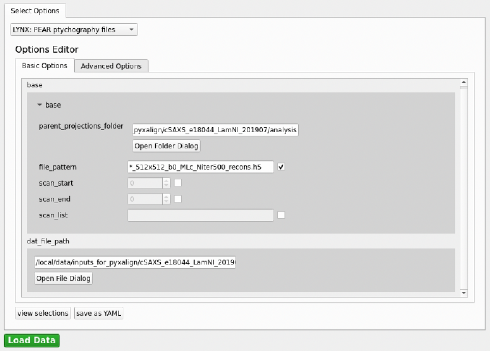

   *Basic Options tab with paths filled in for a LYNX dataset. The
   parent_projections_folder points to the analysis directory, the
   file_pattern selects 512×512 reconstructions at a specific filter
   setting, and the dat_file_path points to the corresponding scan log.*

The **Advanced Options** tab exposes additional loader settings. These
settings can usually be ignored. In this case, I am changing the ``loader_type``
because I am using a fairly old dataset that uses a slightly different file format.
I also set ``selected_sequences`` (a LYNX specific setting) to specify that I 
only want to load a subset of the laminography dataset.

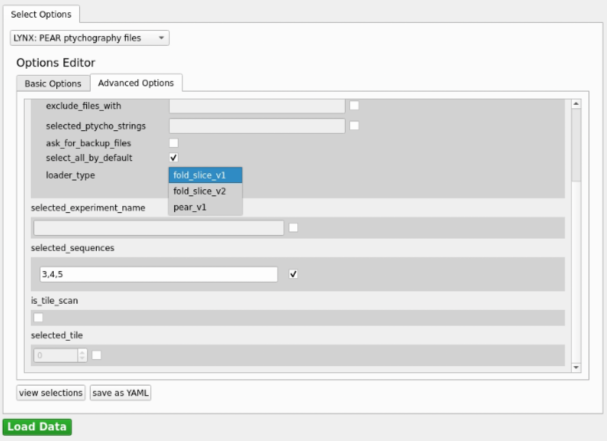

   *Advanced Options tab*

After clicking **Load Data**, a new window that displays the data will appear. The **Projections** tab displays a the phase of all loaded projections (for that matter, all of ``pyxalign``'s' projection viewers show the *phase* of the projections). A table shows all the scan numbers, the measurement angle, and filepaths for each ptychography reconstruction. The object pixel size and the shape of the loaded probe is also displayed.

Update the values in the **Initialization Configuration** section before clicking
the **Initialize Projections Object** button to proceed:
    - ``pad`` -  determines the extent of the padding around each projection. Each projection can have different dimensions, so the dimensions of the new projections array is equal to the largest projection dimensions plus ``pad``. Padding is necessary to prevent the edges of the projection from being cut off when aligning the projections.
    - ``laminography_angle`` -  laminography tilt angle of the sample stage. Set to 90 degrees for tomography. This value can be updated later if needed.
    - ``rotation_angle`` -  rotation to be applied to the projection array.
    - ``shear_angle`` -  skew to be applied to the projection array.
    - ``remove_scan_numbers`` -  comma delimited list of scan numbers to remove. You can also remove scans later.


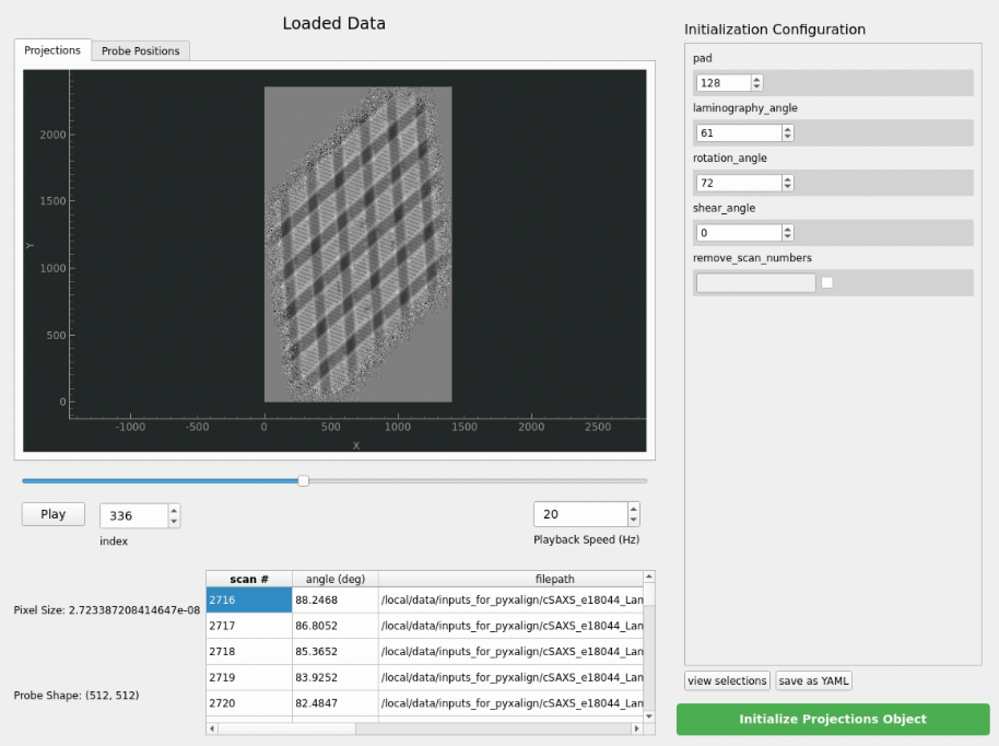

   *Loaded Data window with the Projections tab active.*

The **Probe Positions** tab shows the probe positions from the ptychography scan.

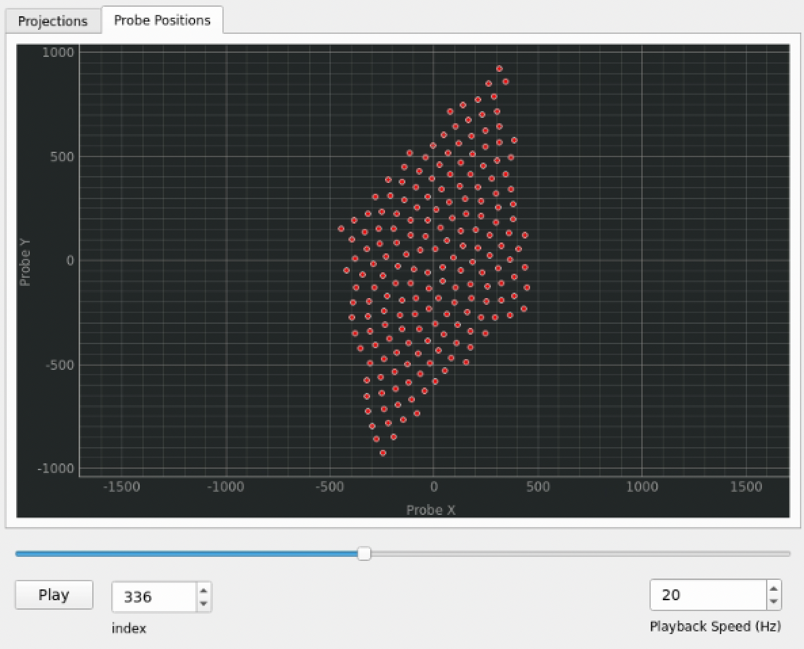

   *Probe Positions tab showing the location of scan positions for
   scan index 336.*

Removing Bad Measurements
--------------------------

The next window that appears will show the new projection array and has various tools for processing the dataset.

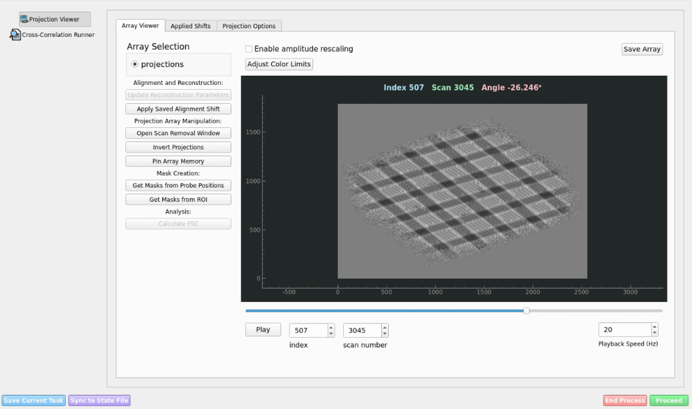

The first thing you should do is remove bad scans from the dataset. To do this, click the "Open Scan Removal Window" button and use the slider to manually look for bad scans. When you find a bad scan, click "mark for removal" to add it to the list of scans staged for removal. After you have finished looking for bad scans, click "Permanently Remove Scans" to remove them.

.. list-table::
   :widths: 50 50
   :class: align-bottom-cells

   * - .. figure:: ../_static/screenshot_10.png
            :align: center
            :class: bordered-image

            *Scan removal tool with list of scans to remove*

     - .. figure:: ../_static/screenshot_11.png
            :align: center
            :class: bordered-image

            *Scan removal tool after removing scans*

Cross-Correlation Alignment
----------------------------

After removing any bad scans, navigate to the cross-correlation alignment tool by clicking the "Cross-Correlation Runner" button on sidebar.

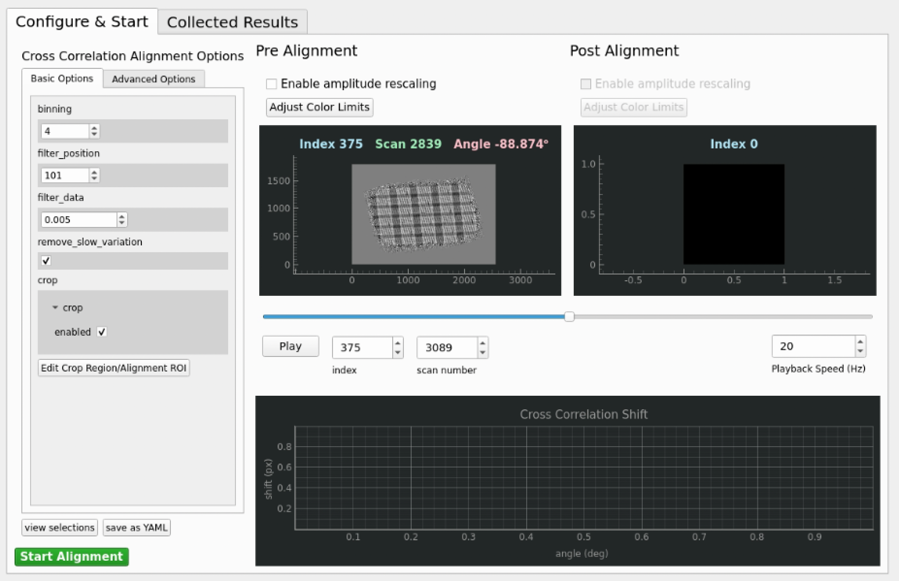

   *Cross-correlation alignment tool.*

When doing cross-correlation alignment, you need to crop the image so that each scan shows only the region where the measurement is valid. To do this, check the ``crop.enabled`` box and then click the "Edit Crop Region/Alignment ROI" button top open the crop window. Update the size of the box so that the enclosed region is valid for all scan indices.

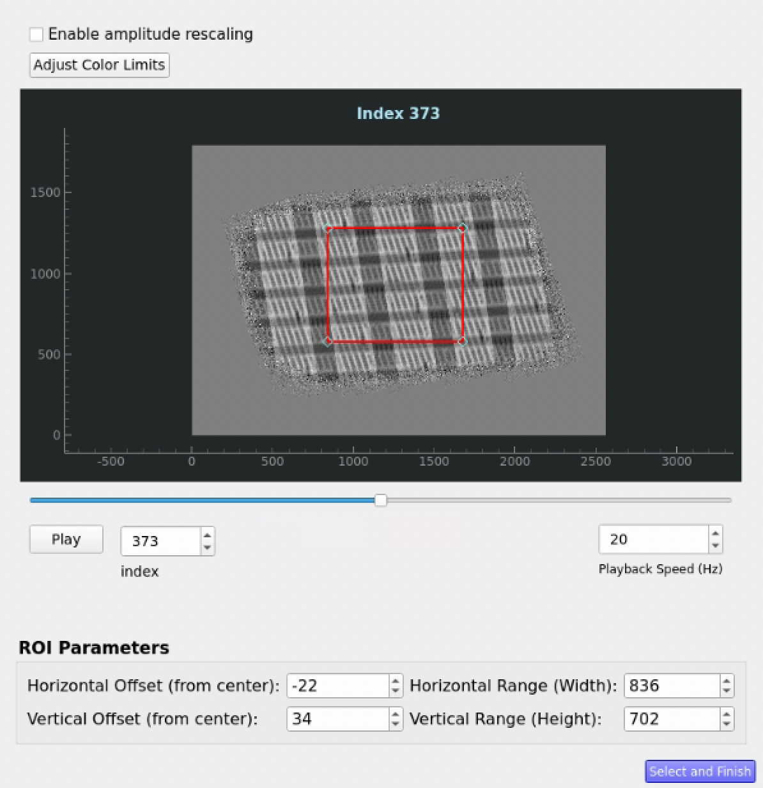

   *Cropping tool with a good crop region selected.*

Click the "Start Alignment Button" and wait for the alignment to finish. Click the "Play" button or drag the slider to view the proejctions before and after alignment.

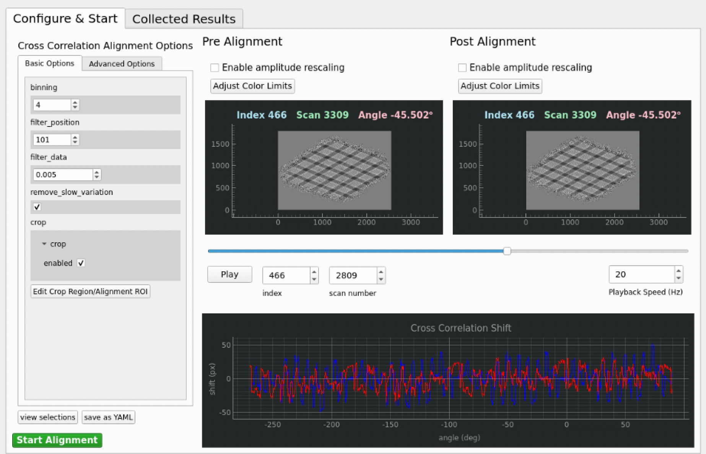

   *Cross-correlation alignment tool after alignment.*

Once you are happy with the results, navigate back to the "Projection Viewer" button on the sidebar and then open the "Applied Shifts" tab. Click "Apply Staged Shift" to apply the cross-correlation shift to the projections.

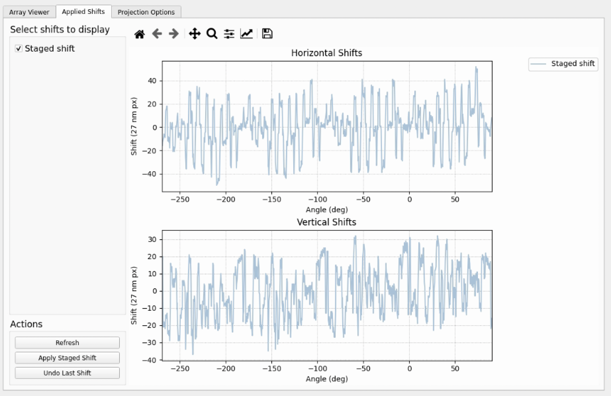

   *Applied shifts tab with the cross-correlation shift staged.*

The applied shifts keeps a record of all shifts that have been applied to the projections. You can undo these shifts by simply clicking the "Undo Last Shift" button.

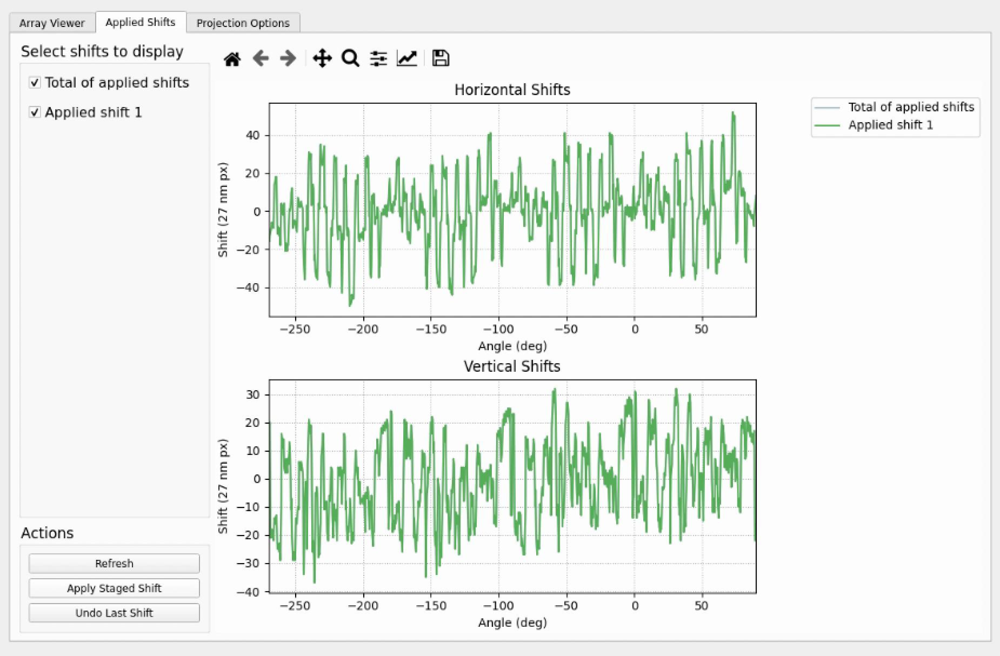

   *Applied shifts tab after applying the cross-correlation shift.*

*Note: cross-correlation alignment is not always necessary to achieve good alignment. The projection-matching alignment that is done later is often all you need. You can also choose to skip cross-correlation for now and instead do it after unwrapping the projections.*

Phase Unwrapping
-----------------

Before unwrapping the phase, you need to define the region where the measurement is valid for each scan. Do this by increasing ``Threshold`` until the size of the masks is adequate.

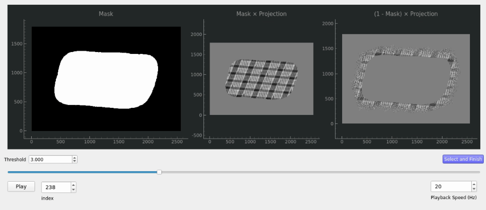

   *Phase-unwrapping mask selection screen.*

After selecting the masks, the phase-unwrapping window will appear. Update the phase unwrapping settings and then click "Unwrap Phase".

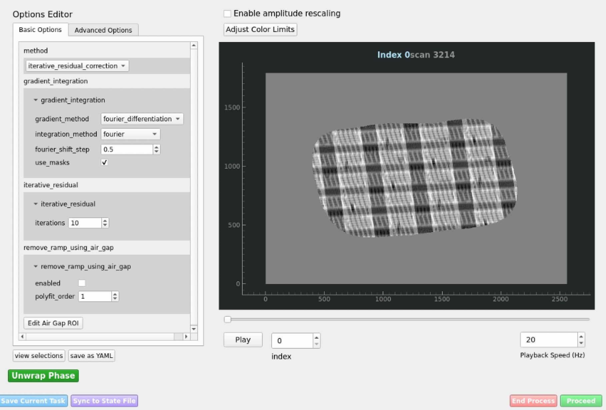

   *Phase-unwrapping window.*

Click "Proceed" after unwrapping the phase.

Setting 3D Reconstruction Parameters
--------------------------------------

Next, we need to update the reconstruction parameters. First, click "Select Center of Rotation" and then click "Show Projections Sum" in the new window. Click your best estimate for where the center of rotation is and then click "select and finish".

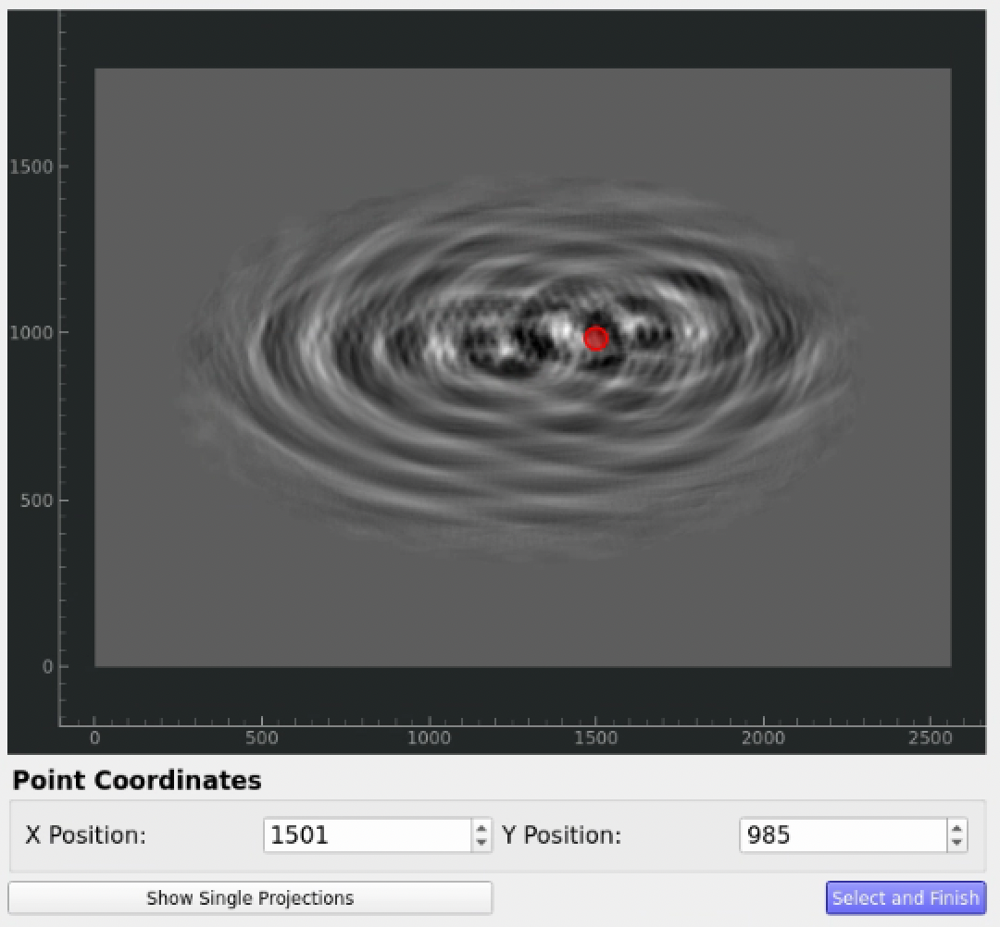

   *Center of rotation selection window.*

Click "Run 3D Reconstruction" to get the 3D reconstruction. 

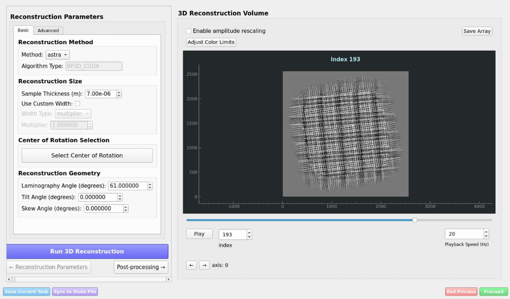

   *3D parameter selection window with reconstructed 3D volume.*

Click the arrow buttons below the display to change the view-axis of the 3D reconstruction. 

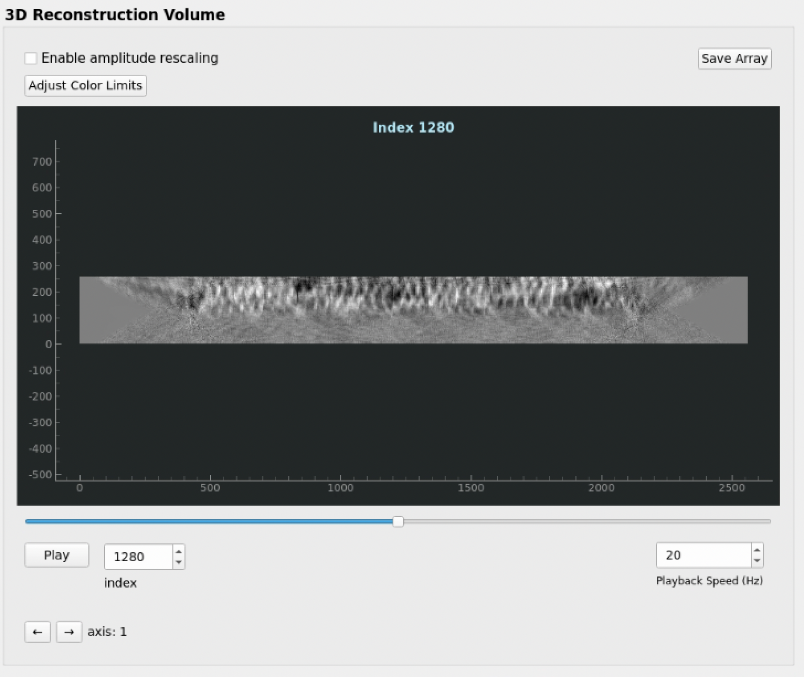

   *3D volume viewed from axis 1.*

Update the reconstruction parameters so that no part of the reconstruction is being cutoff and it is well contained/centered:
    - To translate the 3D reconstruction vertically when viewing from axis 1 and 2, change the vertical center of rotation
    - To increase the size of the reconstruction when viewing from axis 1 and 2, increase the sample thickness
    - To change the size of the reconstruction when viewing from axis 0, click "Use Custom Width" and change the value of "Multiplier"
After changing these parameters, click "Run 3D Reconstruction" again to see the changes.

Projection-Matching Alignment
------------------------------

Define Masks for Projection-Matching
~~~~~~~~~~~~~~

You must define a mask for the region used to calculate step size updates in the projection-matching algorithm. Typically this region should be smaller than the masks used for phase-unwrapping.

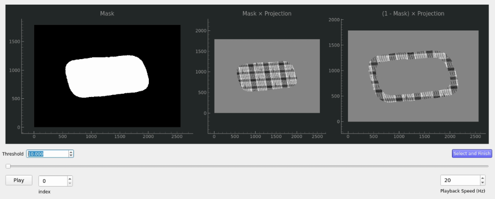

   *Build smaller masks before projection-matching alignment.*

Running Projection-Matching Alignment
~~~~~~~~~~~~~~

The projection-matching alignment screen contains two panels for settings options. The panel on the left is where you set default options. The panel on the right is where you set options used to align the projections in sequence. 

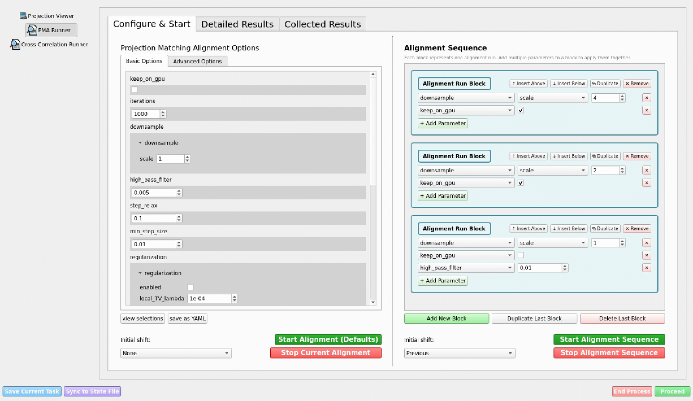

   *Projection-matching alignment screen.*

Select default settings, and run the projection-matching alignment using these settings by clicking "Start Alignment (Defaults)".

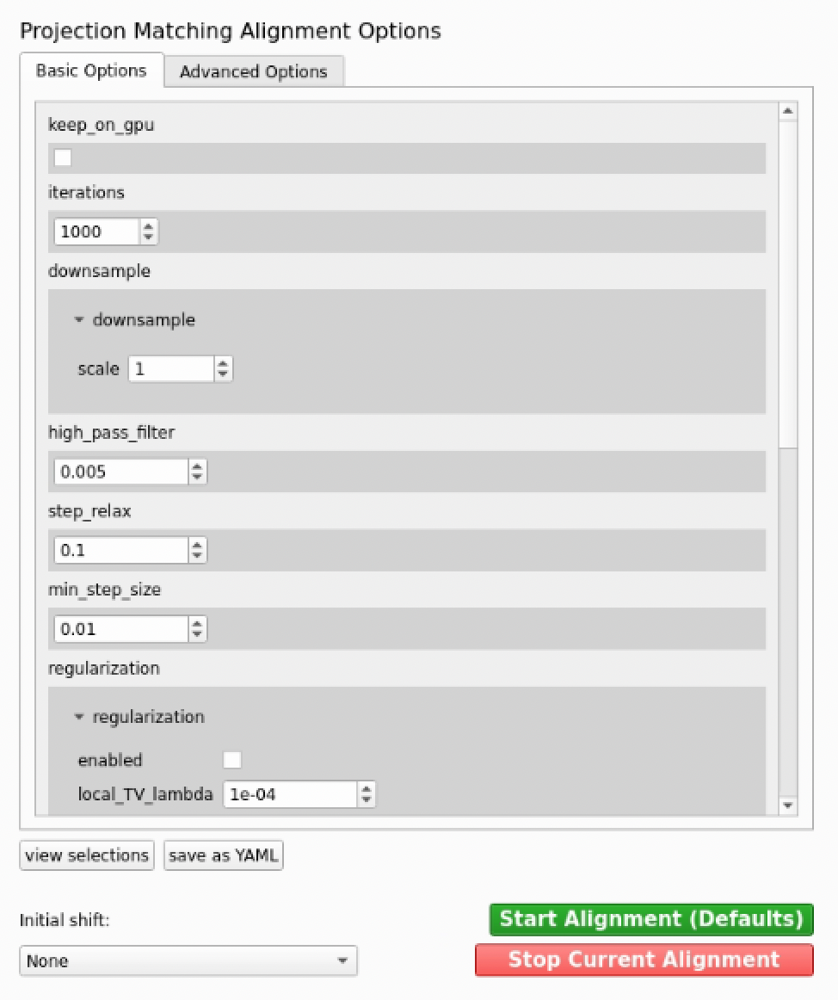

   *Projection-matching alignment default settings editor.*

To get an optimally aligned 3D reconstruction, you typically have to do a multi-step projection-matching alignment sequence in which the downsampling scale is decreased at each step. Then, the high pass filter frequency cutoff should be increased at the end of alignment. Start the alignment sequence by clicking "Start Alignment Sequence".

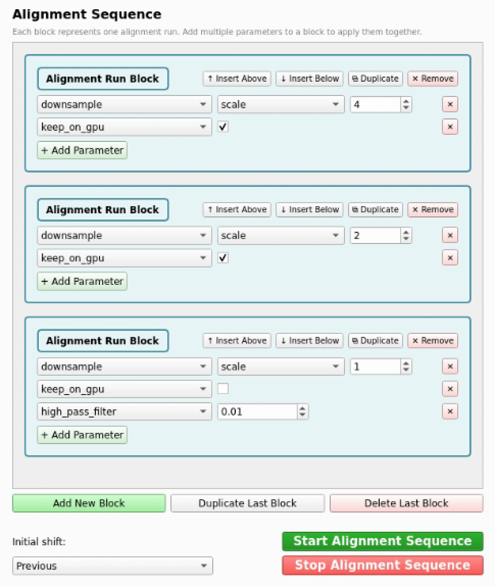

   *Projection-matching alignment settings sequencer. In this example, the projection-matching alignment will run at downsampling scale values of 4, 2, and then 1 (no downsampling). At the final step, the high pass filter is changed to 0.01.*

Once alignment is started, the interactive projection-matching alignment viewer will pop up. This window shows live updates for the projection-matching alignment. There are multiple tabs that you can use to assess the progress of the alignment algorithm:

The metrics tab shows quantities related to the alignment algorithm, such as the current alignment shift and the projection-matching alignment error. The alignment will automatically stop once the max step size update (shown in the lower left plot) is less than or equal to the stopping condition indicated by ``min_step_size``.

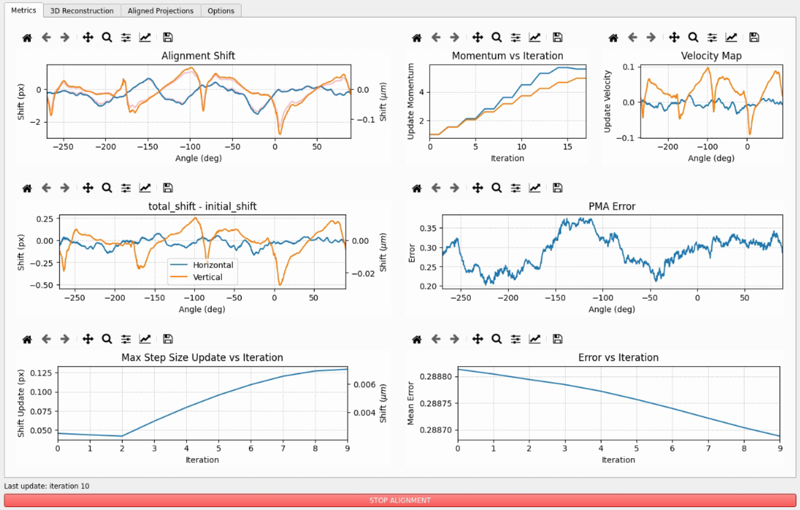

   *Projection-matching alignment window, metrics tab*

The "3D Reconstruction" tab shows the downsampled 3D reconstruction for the current alignment shift.

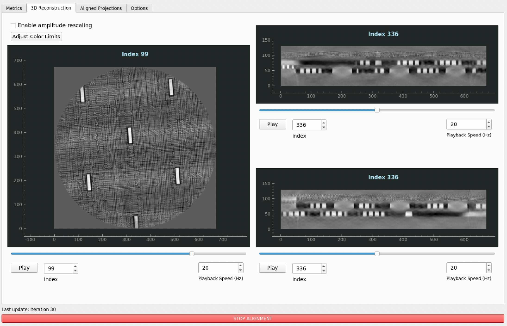

   *Projection-matching alignment window, 3D reconstruction tab*

The "Aligned Projections" tab shows the aligned projection arrays and other relevant arrays.

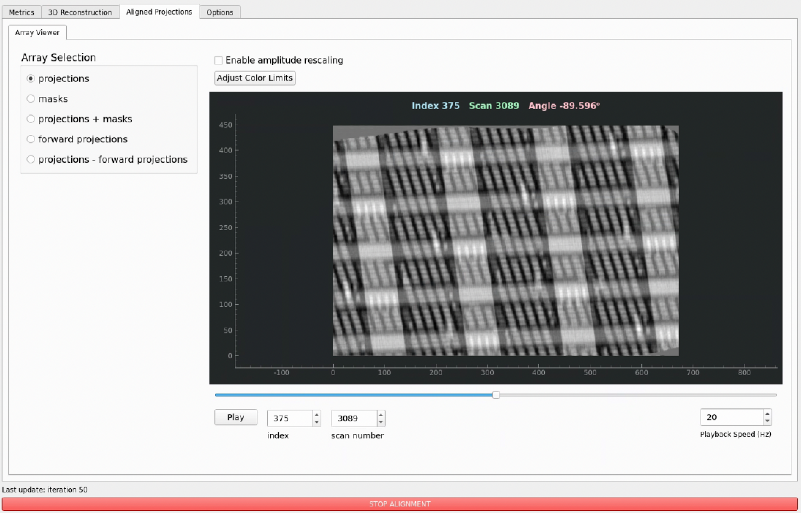

   *Projection-matching alignment window, projections tab*

Viewing and Applying Projection-Matching Alignment Results
~~~~~~~~~~~~~~

Each time the alignment is run, the resulting shift will be "staged" and can then be applied by navigating to the "Projection Viewer" page, then to the "Applied Shifts" tab, and clicking the "Apply Staged Shift" button. 

You can also stage a shift from an earlier alignment run by navigating to the "Collected Results" tab on the "PMA Runner" page. This page keeps a record of each run of the projection-matching alignment algorithm. You can stage any of the recorded shifts by clicking the entry in the "Select Alignment Results Index" table and then clicking the "Stage Selected Shift" button.

*Note: applying a staged shift will clear the alignment results stored in the "Collected Results" tab.*

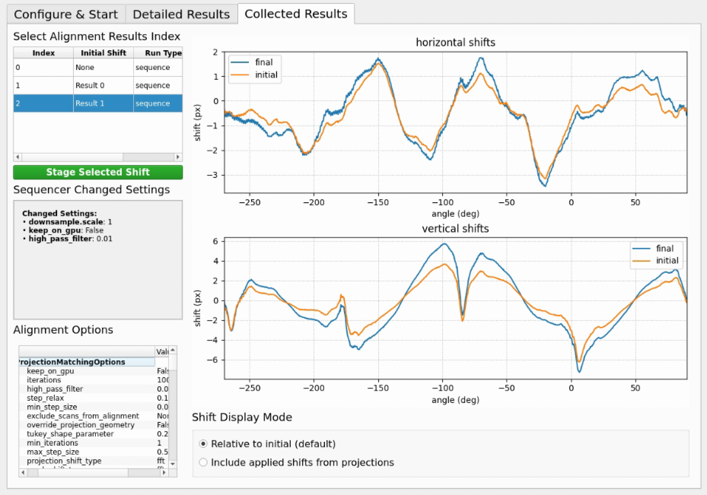

   *Projection-matching alignment configuration window, collected results tab*

Initial Shift Configuration
~~~~~~~~~~~~~~

There are two drop-downs for configuring the initial alignment shift used by the projection-matching alignment algorithm. The **Defaults Initial Shift** and the **Sequencer Initial Shift**. 

- The **Defaults Initial Shift** determines the starting shift used on the defaults run, or on the first step of the sequencer run.

    - ``None`` - No initial shift will be used.
    - ``Previous`` - The most recent alignment shift will be used.
    - ``Result x`` - The corresponding shift from the "Collected Results" tab will be used.

- The **Sequencer Initial Shift** determines the starting shift on each step of the sequencer.

    - ``None`` - No initial shift will be used for all alignment run blocks.
    - ``Previous`` - The first alignment run in the sequence will use the initial shift specified by the **Defaults Initial Shift** drop-down, and subsequent alignment runs will use the alignment obtained from the preceeding alignment run block. This is the option that should be used when doing multi-step alignment runs.
    - ``Default`` - All alignment runs will use the initial shift specified by the **Defaults Initial Shift** drop-down.

.. list-table::
   :widths: 50 50
   :class: align-bottom-cells

   * - .. figure:: ../_static/screenshot_48.png
          :align: center
          :class: bordered-image1

          *Defaults Initial Shift options*

     - .. figure:: ../_static/screenshot_49.png
          :align: center
          :class: bordered-image

          *Sequencer Initial Shift options*


For multi-step alignment, the **Sequencer Initial Shift** should be set to ``Previous``. Using ``None`` or ``Default`` is useful for doing parameter searches (ex: the projection-matching algorithm can get stuck in local minima if the run parameters are not good, so you would want to test out a series of different parameters in that case. The downsampling scale and high pass filter frequency cutoff are good parameters to tune in this case.)

.. note::

   More tips on projection-matching parameter selection will be added later.


Fourier Shell Correlation
--------------------------

Once the data has been aligned, you can calculate the Fourier shell correlation (FSC) by navigating to the "Projection Viewer" and clicking the "Calculate FSC" button. 

First, click "Calculate Volumes for FSC". This generates 2 volumes by randomly splitting the projections into 2 seperate datasets and reconstructing the volume via filtered back-projection. 

Next, click "Select 3D Crop" to specify the region used in the FSC. Use the arrow buttons to switch the axis and change the box size appropriately. Click the "Show Cropped Volume" button to inspect the bounded region you have selected. Click "Select and Finish" to save the configuration.

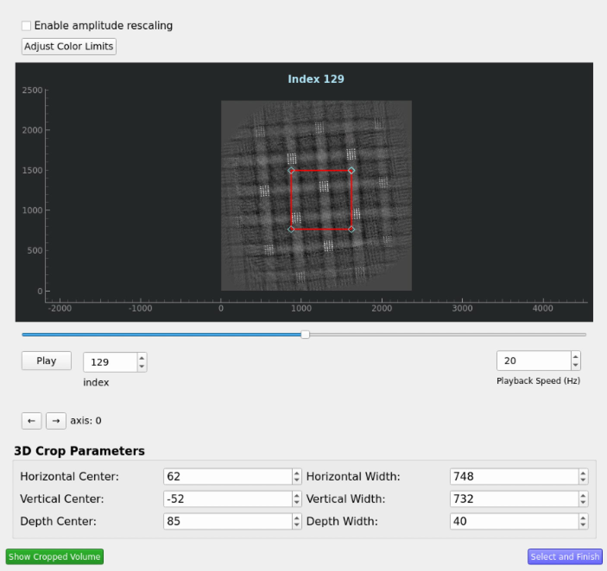

   *FSC region selection tool*

Click "Calculate Fourier Shell Correlation" to get the FSC. The resolution at which the FSC crosses the 1/2-bit curve will be printed in the terminal window.

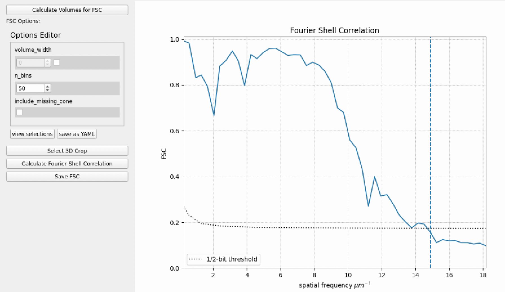

   *FSC window with the result displayed*

Save the FSC results to an HDF5 file by clicking "Save FSC".

Saving Final Results
---------------------

After finishing projection-matching alignment and the calculation of the FSC, click the "proceed" button to move on to the final window where you will create and save a finalized 3D reconstruction. Get the 3D reconstruction, and then click the "Save Array" button to save 3D reconstruction array to TIFF and/or HDF5 files.

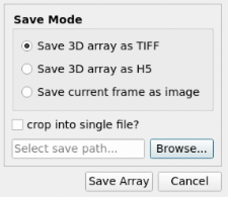
   *3D reconstruction file-saving window*

Some 3D volumes (like chips) can be automatically rotated so that its features line up with the cartesian plane. This is done by finding the rotation angles that optimize the 3D array's Hoyer sparsity measure. Click the "Post-processing ->" button and then "Estimate Rotation Angles" to find the optimal rotation angles. click "Apply Rotation to Volume" to rotatate the 3D volume.

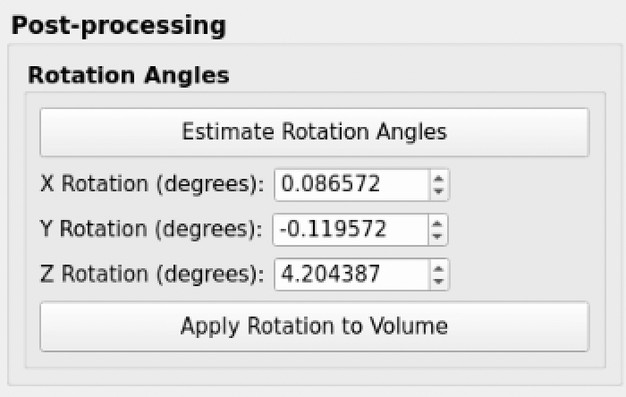

   *Volume rotation controls*

.. list-table::
   :widths: 50 50
   :class: align-bottom-cells

   * - .. figure:: ../_static/screenshot_50.png
          :align: center
          :class: bordered-image1

          *Volume before rotation*

     - .. figure:: ../_static/screenshot_52.png
          :align: center
          :class: bordered-image

          *Volume after rotating to maximize Hoyer sparsity*